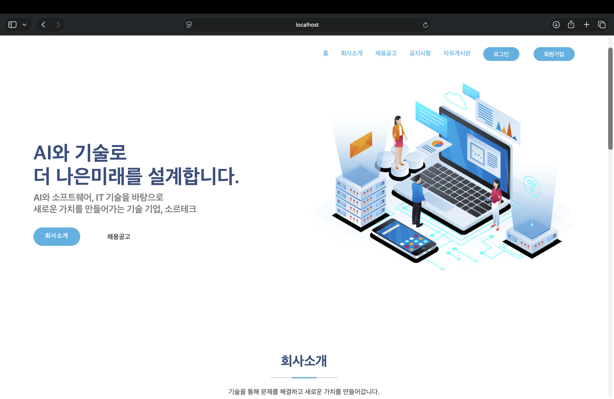
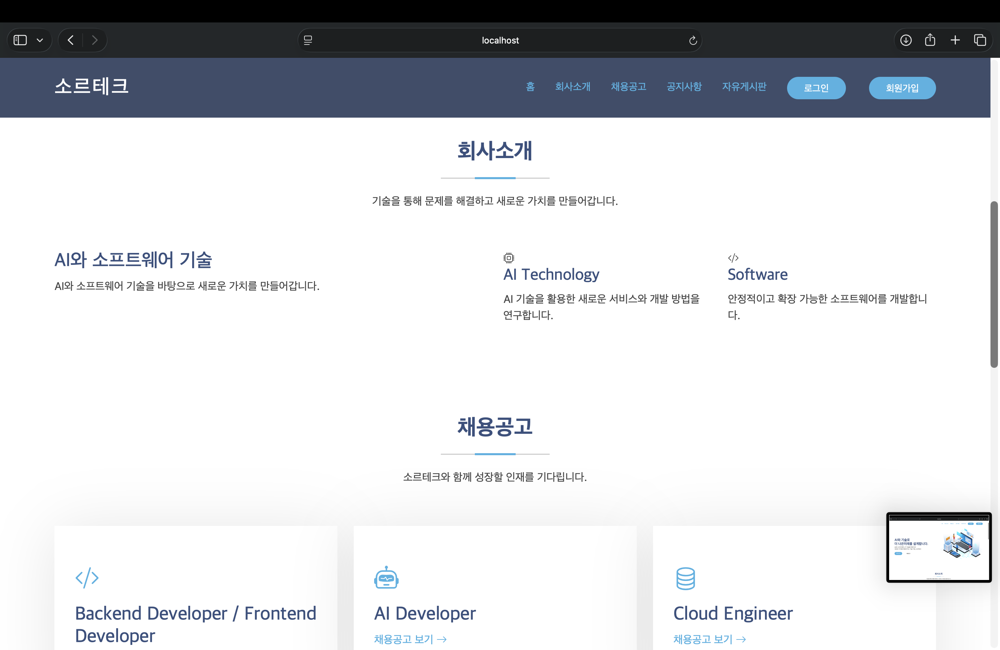
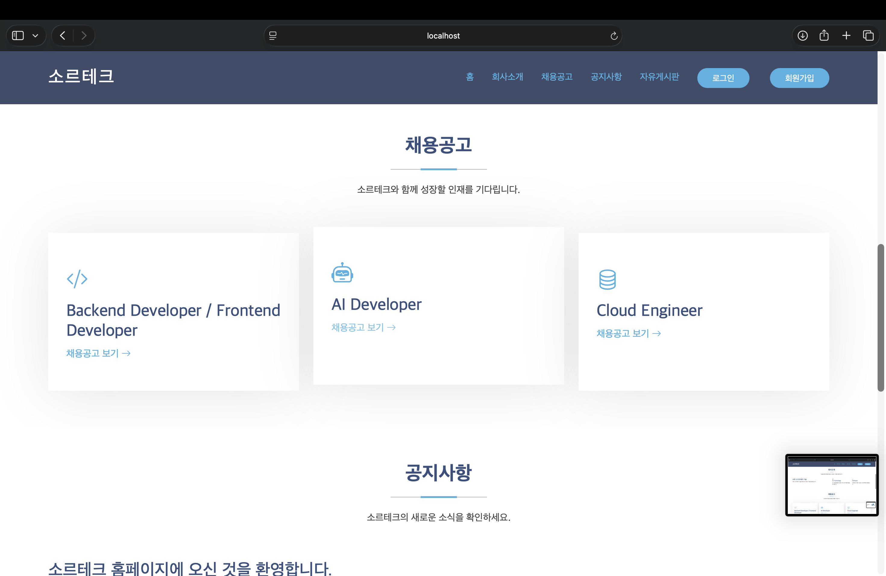
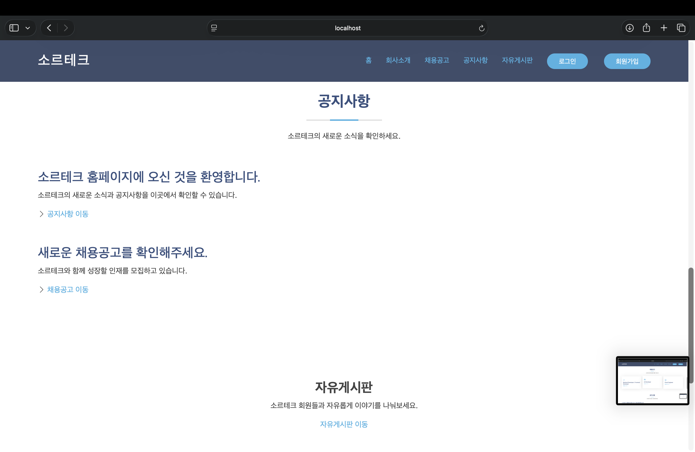
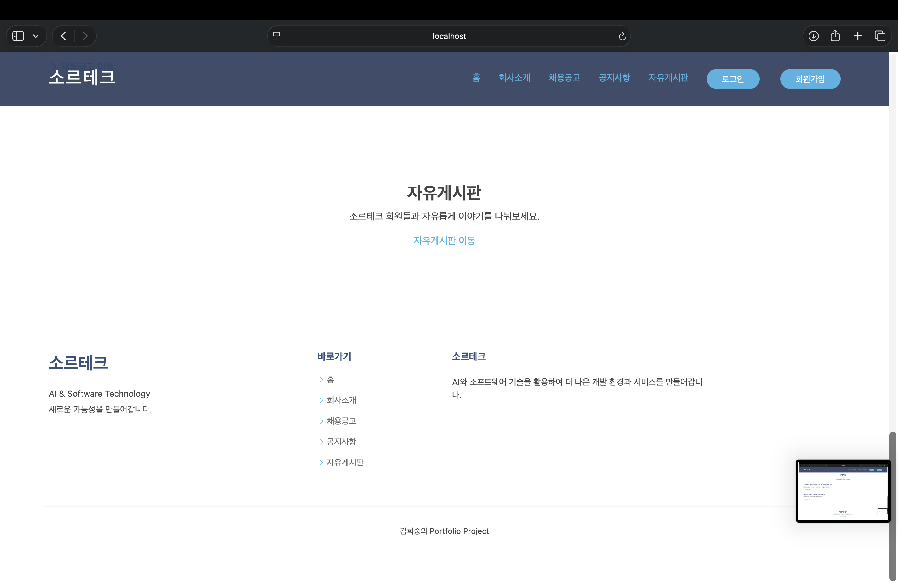
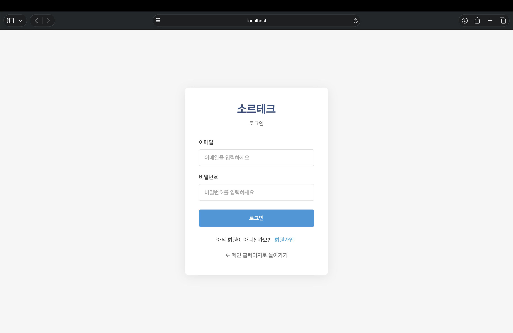
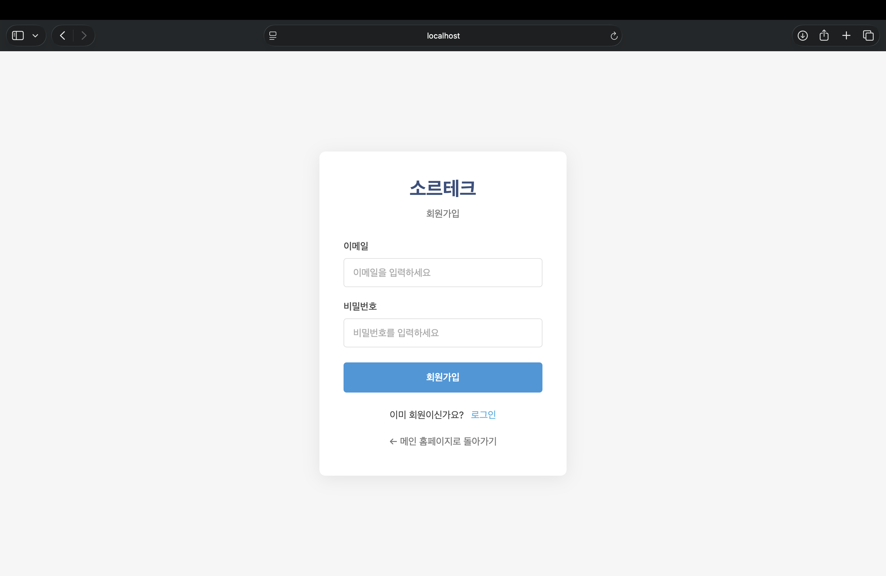
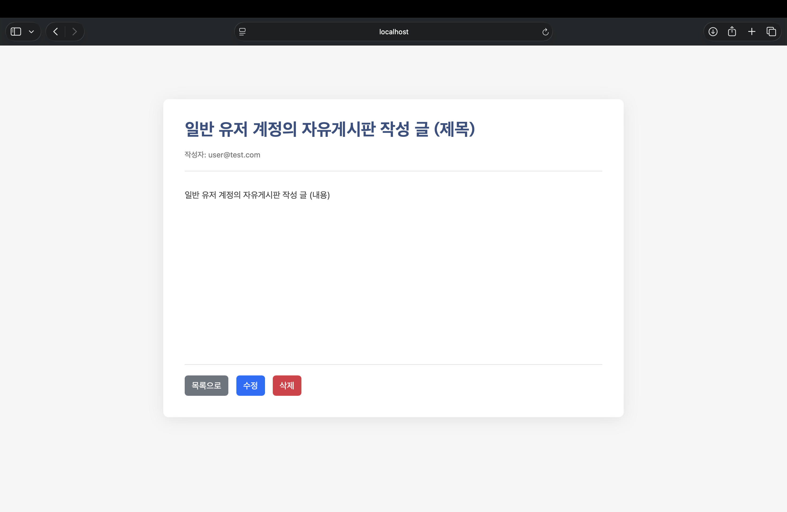
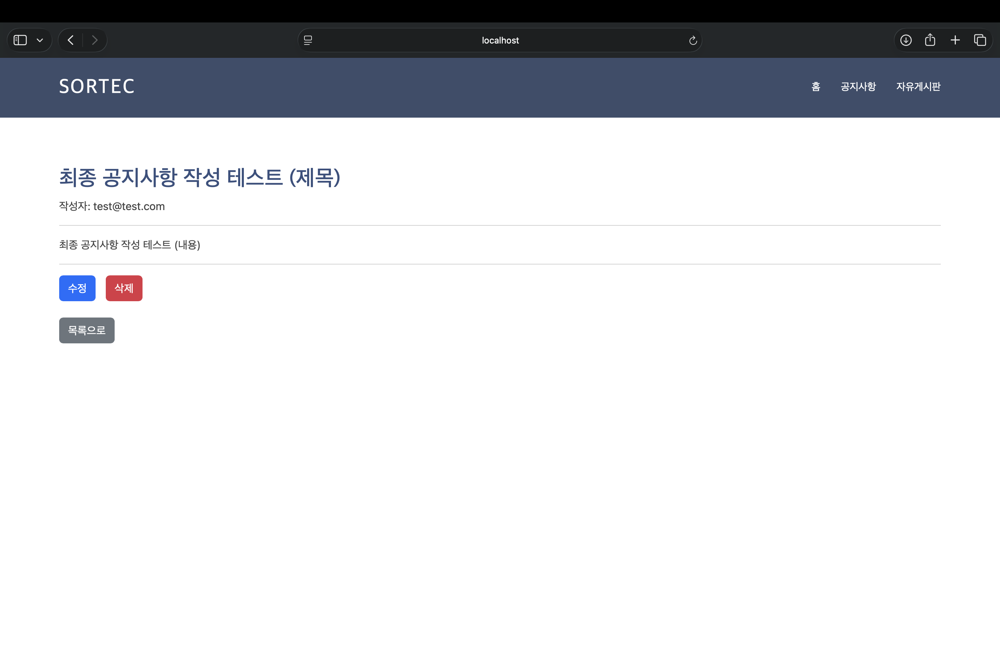
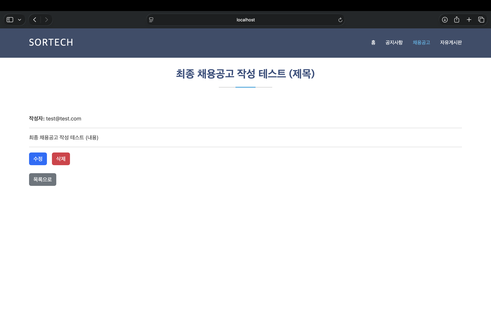

# 소르테크 기업 홈페이지

> AI와 소프트웨어 기술을 바탕으로 기업 홈페이지와 게시판 서비스를 구현한 Spring Boot 기반 웹 프로젝트입니다.

---

## 1. 프로젝트 소개

소르테크 기업 홈페이지를 가상의 기업 홈페이지 형태로 구현한 개인 포트폴리오 프로젝트입니다.

기업 홈페이지에서 필요한 회사소개, 채용공고, 공지사항, 자유게시판 기능을 구현하고, 회원가입 및 로그인 기능과 일반 사용자 / 관리자 권한을 분리하여 실제 웹 서비스와 유사한 구조로 개발했습니다.

Spring Boot와 Spring Security, JPA, MySQL을 활용하여 백엔드 기능을 구현했으며, Validation과 예외처리를 적용하여 잘못된 요청이나 권한이 없는 사용자의 접근을 제한했습니다.

---

## 2. 프로젝트 목적

### 개발 목적

- Spring Boot 기반 웹 애플리케이션 개발 경험
- 데이터베이스를 활용한 CRUD 기능 구현
- Spring Security를 활용한 인증 및 인가 구현
- 일반 사용자와 관리자 권한 분리
- Validation 및 예외처리 적용
- 실제 서비스 형태의 프로젝트 구조 경험
- AI를 활용한 개발 및 문제 해결 경험

---

## 3. 프로젝트 정보

| 항목 | 내용 |
|---|---|
| 프로젝트명 | 소르테크 기업 홈페이지 |
| 개발 형태 | 개인 프로젝트 |
| 개발 기간 | 2026.09 ~ 2026.10 |
| 개발 환경 | IntelliJ IDEA |
| 운영체제 | macOS |
| Java | 21 |
| Spring Boot | 4.1.1 |
| Database | MySQL |
| ORM | Spring Data JPA |
| Security | Spring Security |
| Frontend | HTML, JavaScript, Bootstrap |
| API 테스트 | Postman |
| 형상관리 | Git / GitHub |

---

## 4. 기술 스택

### Backend

- Java 21
- Spring Boot 4.1.1
- Spring Security
- Spring Data JPA
- Bean Validation

### Database

- MySQL

### Frontend

- HTML5
- JavaScript
- Bootstrap 5

### Development & Tools

- IntelliJ IDEA
- MySQL Workbench
- Postman
- Git
- GitHub

### AI

- 생성형 AI를 활용한 코드 작성 및 구조 설계 보조
- 오류 원인 분석 및 디버깅
- 개발 과정에서의 기술 검토 및 문제 해결 보조

---

## 5. 주요 기능

### 회원 기능

- 회원가입
- 로그인
- 로그아웃
- 로그인 사용자 확인
- 비로그인 사용자 접근 제한

### 자유게시판

- 게시글 조회
- 게시글 작성
- 게시글 수정
- 게시글 삭제
- 작성자 본인 여부 확인
- 관리자 게시글 삭제 권한

### 공지사항

- 공지사항 조회
- 공지사항 작성
- 공지사항 수정
- 공지사항 삭제
- 관리자 권한 적용

### 채용공고

- 채용공고 조회
- 채용공고 작성
- 채용공고 수정
- 채용공고 삭제
- 관리자 권한 적용

### 보안 및 예외처리

- Spring Security 기반 인증
- 사용자 / 관리자 권한 분리
- API 인증 실패 시 401 응답
- 권한이 없는 요청 제한
- Validation 적용
- 존재하지 않는 게시글 예외처리
- 게시글 작성자 권한 확인

---

## 6. 사용자 권한

| 기능 | 일반 사용자 | 관리자 |
|---|:---:|:---:|
| 회원가입 | O | O |
| 로그인 | O | O |
| 홈페이지 조회 | O | O |
| 자유게시판 조회 | O | O |
| 자유게시판 작성 | O | O |
| 본인 게시글 수정 | O | O |
| 본인 게시글 삭제 | O | O |
| 다른 사용자 게시글 삭제 | X | O |
| 공지사항 조회 | O | O |
| 공지사항 작성 | X | O |
| 공지사항 수정 | X | O |
| 공지사항 삭제 | X | O |
| 채용공고 조회 | O | O |
| 채용공고 작성 | X | O |
| 채용공고 수정 | X | O |
| 채용공고 삭제 | X | O |

---


## 7. 데이터베이스

MySQL을 사용하여 회원 및 게시판 데이터를 관리했습니다.

주요 데이터는 다음과 같이 구성했습니다.

```text
sortech
├── user
├── free_board
├── notice
└── recruitment
```

각 게시판 데이터에는 작성자, 제목, 내용 등의 정보를 저장하고 JPA를 통해 데이터베이스와 객체를 연결했습니다.

---

## 8. 인증 및 권한 처리

Spring Security를 사용하여 로그인 사용자의 인증 상태를 관리했습니다.

사용자가 로그인하면 인증 정보를 기반으로 현재 로그인한 사용자를 확인할 수 있도록 구성했습니다.

또한 사용자 역할에 따라 접근 가능한 기능을 구분했습니다.

```text
사용자 로그인
      ↓
Spring Security 인증
      ↓
사용자 권한 확인
      ↓
┌───────────────┐
│               │
USER          ADMIN
│               │
자유게시판       자유게시판
조회/작성        전체 관리
본인 글 수정     공지사항 CRUD
본인 글 삭제     채용공고 CRUD
```

특히 자유게시판의 경우 일반 사용자는 본인이 작성한 게시글만 수정 및 삭제할 수 있으며, 관리자는 다른 사용자의 게시글도 삭제할 수 있도록 구현했습니다.

---

## 9. Validation 및 예외처리

사용자가 입력하는 게시글의 제목과 내용에 대해 Validation을 적용했습니다.

잘못된 요청이 발생하거나 존재하지 않는 게시글을 요청하는 경우 예외를 처리하여 사용자에게 적절한 메시지를 전달하도록 구현했습니다.

예시:

```text
게시글을 찾을 수 없습니다.
게시글 작성자만 수정할 수 있습니다.
게시글 작성자만 삭제할 수 있습니다.
제목을 입력해주세요.
내용을 입력해주세요.
```

이를 통해 단순히 정상적인 요청만 처리하는 것이 아니라 예외적인 상황까지 고려하여 서비스를 구현했습니다.

---

## 10. 주요 화면

### 메인 홈페이지

기업 홈페이지 형태로 회사소개, 채용공고, 공지사항, 자유게시판으로 이동할 수 있도록 구성했습니다.

> 
> 
> 
> 
> 

---

### 로그인

Spring Security를 기반으로 로그인 기능을 구현했습니다.

> 

---

### 회원가입

사용자가 새로운 계정을 생성할 수 있도록 회원가입 기능을 구현했습니다.

> 

---

### 자유게시판

일반 사용자가 게시글을 작성하고 본인의 게시글을 수정 및 삭제할 수 있도록 구현했습니다.

> 

---

### 공지사항

관리자가 공지사항을 작성, 조회, 수정, 삭제할 수 있도록 CRUD 기능을 구현했습니다.

> 

---

### 채용공고

관리자가 채용공고를 작성, 조회, 수정, 삭제할 수 있도록 구현했습니다.

> 

---

## 11. API 테스트

Postman을 활용하여 주요 API의 정상 동작 여부를 테스트했습니다.

### 회원

```text
POST /api/signup
POST /api/login
```

### 자유게시판

```text
GET    /api/free-board
GET    /api/free-board/{id}
POST   /api/free-board
PUT    /api/free-board/{id}
DELETE /api/free-board/{id}
```

### 공지사항

```text
GET    /api/notice
GET    /api/notice/{id}
POST   /api/notice
PUT    /api/notice/{id}
DELETE /api/notice/{id}
```

### 채용공고

```text
GET    /api/recruitment
GET    /api/recruitment/{id}
POST   /api/recruitment
PUT    /api/recruitment/{id}
DELETE /api/recruitment/{id}
```

---

## 12. 테스트 결과

주요 기능에 대한 실제 테스트를 진행했습니다.

| 테스트 항목 | 결과 |
|---|:---:|
| 회원가입 | PASS |
| 로그인 | PASS |
| 로그아웃 | PASS |
| 자유게시판 작성 | PASS |
| 자유게시판 조회 | PASS |
| 자유게시판 수정 | PASS |
| 자유게시판 삭제 | PASS |
| 관리자 로그인 | PASS |
| 공지사항 작성 | PASS |
| 공지사항 조회 | PASS |
| 공지사항 수정 | PASS |
| 공지사항 삭제 | PASS |
| 채용공고 작성 | PASS |
| 채용공고 조회 | PASS |
| 채용공고 수정 | PASS |
| 채용공고 삭제 | PASS |
| 사용자 권한 분리 | PASS |
| Validation | PASS |
| 예외처리 | PASS |

---


## 13. AI 활용

본 프로젝트에서는 생성형 AI를 개발 보조 도구로 활용했습니다.

### 활용 분야

- 프로젝트 구조 설계
- Spring Boot 코드 작성 보조
- Spring Security 설정 검토
- 오류 원인 분석
- API 구현 및 수정
- Validation 및 예외처리 검토
- HTML / JavaScript 구현 보조
- 테스트 과정에서 발생한 문제 분석

### AI 활용 방식

단순히 AI가 작성한 코드를 그대로 사용하는 방식이 아니라,

```text
문제 발생
   ↓
AI를 활용하여 원인 분석
   ↓
코드 구조 및 해결 방법 검토
   ↓
직접 코드 적용
   ↓
실행 및 테스트
   ↓
문제 발생 시 재분석
   ↓
최종 동작 확인
```

과 같은 방식으로 활용했습니다.

AI를 개발 보조 도구로 활용하면서도 실제 코드의 동작 원리와 Spring Boot, Spring Security, JPA의 구조를 이해하고 직접 검증하는 것을 중심으로 개발했습니다.

---

## 14. 프로젝트를 통해 학습한 내용

### Spring Boot

- Controller / Service / Domain 계층 구조
- REST API 구현
- 요청 및 응답 처리
- 의존성 주입

### Spring Data JPA

- Entity 설계
- Repository 사용
- 데이터 저장 및 조회
- CRUD 구현

### Spring Security

- 인증(Authentication)
- 인가(Authorization)
- 사용자 권한 관리
- 로그인 / 로그아웃
- 인증되지 않은 API 요청 처리

### Database

- MySQL 데이터베이스 구성
- 테이블 설계
- 데이터 CRUD
- SQL을 활용한 데이터 확인 및 관리

### Web

- HTML 기반 화면 구성
- JavaScript를 이용한 API 호출
- Fetch API
- Bootstrap을 활용한 UI 구성

---

## 15. 프로젝트를 통해 구현한 핵심 경험

이 프로젝트에서는 단순한 게시판 CRUD를 넘어 실제 웹 서비스에서 발생할 수 있는 인증, 권한, 예외 상황까지 고려하여 구현했습니다.

특히 다음과 같은 기능을 직접 구현하고 테스트했습니다.

- 회원 인증
- 사용자 / 관리자 권한 분리
- 게시판 CRUD
- 작성자 권한 검증
- 관리자 권한 처리
- Validation
- 예외처리
- API 인증 실패 처리
- 데이터베이스 연동
- 환경변수를 이용한 민감정보 관리

이를 통해 Spring Boot 기반 웹 애플리케이션의 전체적인 개발 흐름을 경험했습니다.

---

## 16. 향후 개선 사항

현재 프로젝트의 핵심 기능은 구현 및 테스트를 완료했습니다.

추후 기능을 확장한다면 다음과 같은 기능을 추가할 수 있습니다.

- 게시글 검색
- 페이징
- 댓글 기능
- 파일 업로드
- 사용자 프로필
- 관리자 대시보드
- 테스트 코드 확대
- CI/CD 환경 구축

---

## 17. 마무리

소르테크 기업 홈페이지 프로젝트를 통해 Spring Boot 기반 웹 애플리케이션의 설계부터 데이터베이스 연동, 인증 및 권한 관리, CRUD, 예외처리, 테스트까지 전체적인 개발 과정을 경험했습니다.

또한 생성형 AI를 개발 과정에 활용하면서 AI를 단순한 코드 생성 도구가 아닌 문제 분석과 개발 생산성을 높이는 보조 도구로 활용하는 경험을 쌓았습니다.